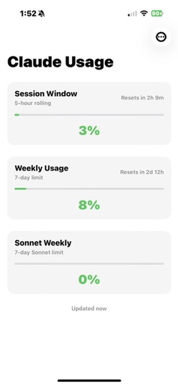
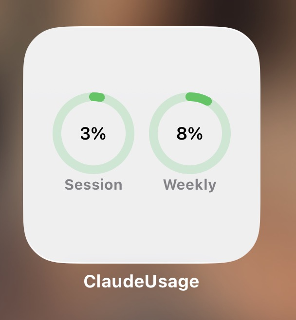
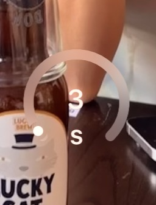

# Claude Usage Widget (iOS)

A simple iOS widget that displays your Claude Pro/Team usage limits, inspired by [Claude Usage Tracker](https://github.com/hamed-elfayome/Claude-Usage-Tracker) for macOS.

## Screenshots

<p align="center">
  
  
  
</p>

## Features

- **Home screen widget**: Session (5h) and weekly usage as color-coded progress rings
- **Lock screen widget**: Compact usage ring for your lock screen
- **Main app**: Paste your session key, view detailed usage, pull-to-refresh

## Setup

1. Open `ClaudeUsage.xcodeproj` in Xcode
2. Set your Development Team in Signing & Capabilities (both targets)
3. Build and run on your iPhone
4. Paste your `sessionKey` cookie from claude.ai
5. Add the widget from your home screen

### Getting your session key

1. Open [claude.ai](https://claude.ai) in a browser
2. Open DevTools (F12) > Application > Cookies > `claude.ai`
3. Copy the value of the `sessionKey` cookie (`sk-ant-sid01-...`)
4. Paste it into the app

## Requirements

- iOS 17+
- Xcode 16+
- Apple Developer Program membership (required for App Groups / widgets on device)

## Project Structure

```
Shared/              Shared between app and widget
  Models.swift       Usage data models and API response types
  KeychainHelper.swift   Keychain storage for session key
  UsageService.swift     Fetches usage from claude.ai API
ClaudeUsage/         Main app target
  ContentView.swift  Session key setup + usage display
ClaudeUsageWidget/   Widget extension target
  ClaudeUsageWidget.swift  Small + medium widget views
project.yml          XcodeGen project definition
```

## Building

The Xcode project is generated with [XcodeGen](https://github.com/yonaskolb/XcodeGen). To regenerate after modifying `project.yml`:

```
brew install xcodegen
xcodegen generate
```

## Notes

- Uses claude.ai's internal API (not officially documented) — may break if Anthropic changes endpoints
- Widget refreshes approximately every 15 minutes (iOS-imposed limit)
- Session keys expire periodically — re-paste from browser when needed
